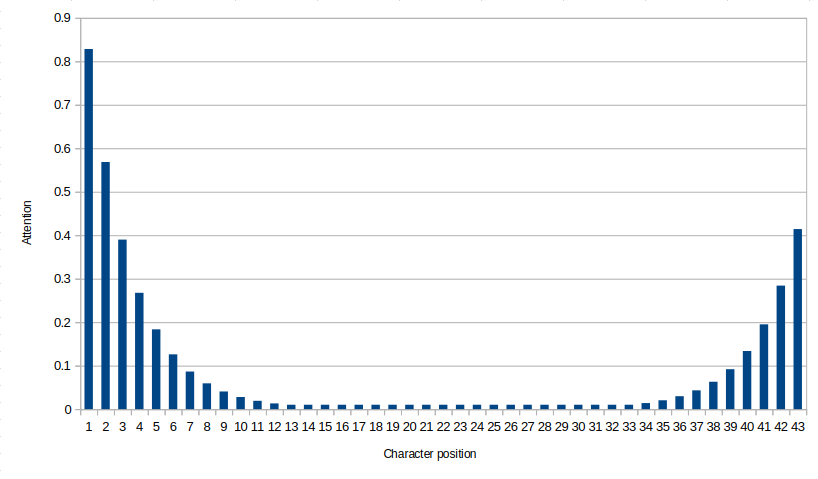

# Fuzzy fingerprint generator

CMD tool for generating "fuzzy fingerprints". These will be an SSH public key
which will have a similar fingerprint to a target fingerprint. If this "fuzzy"
key is used as the public key to an SSH server by a bad actor, then at a
cursory glance during manual verification (when it's missing from the
`known_hosts` file), then it will appear to be correct.

This is achieved by brute forcing SSH keys and fingerprints and then measuring
their "quality" of it compared to the target. This is based an attention
function, and a similarity matrix.

The attention function makes the program focus on the first few and last few
characters of the fingerprint, which are the ones people will be willing to
check. An exponential distribution was used, to model the idea that people
will likely check the first character, some fraction of them will check the
second character, some fraction of *those* people will check the next character
and so on. This distribution was then flipped and scaled by 1/2 for the
last characters. The attention function was the maximum of both distributions
and a small constant.



Further, a similarity score was used when comparing two base 64 characters.
The characters `A - Y` have little in common, but the characters `1 - l` look
quite similar. The data from this was generated manually using the script in
the `python` directory, and stored in a JSON file.

## Installing

Requires [Cargo/Rust](https://rust-lang.org/tools/install/)

- Clone this repository
- Navigate into this repository
- Run `cargo build --release`
- The binary will appear as `target/release/fuzzy`

## Use

To start a search for a fingerprint, run it with the fingerprint as an
argument:

```
./target/release/fuzzy "A6xnQhbz4Vx2HuGl4lXwZ5U2I8iziLRFnhP5eNfIRvQ"
# or
cargo run --release -- "A6xnQhbz4Vx2HuGl4lXwZ5U2I8iziLRFnhP5eNfIRvQ"
```

To continue a previous search:

```
./target/release/fuzzy -c 
# or
cargo run --release -- -c
```

## Results

As an example, the following fingerprint is used, which is the SHA256 of
b"1234" in ASCII:

`A6xnQhbz4Vx2HuGl4lXwZ5U2I8iziLRFnhP5eNfIRvQ`

After running on my laptop over night trying to match it, I came up with this:

```
best result: A6xnWEkIV9wQ+db6YjUH5dJP7ZiEZTJS4auU9FjIT3Q
     target: A6xnQhbz4Vx2HuGl4lXwZ5U2I8iziLRFnhP5eNfIRvQ
```

## Timings

This quality of the fingerprints generated is limited by the rate at which you
could generate keys and fingerprints. Different key types need different
amounts of time, and were tested below

### Timing results

Time it took to preform generate 10 000 keys and their fingerprints:

```
   EC25519:    863ms
ECDSA-P256:  3 476ms
ECDSA-P384: 15 566ms
ECDSA-P521: 19 961ms
```

All these key types took much longer to generate:

```
       DSA:  1 100ms for 1
RSA-SHA256: 22 000ms for 1
RSA-SHA512: 16 700ms for 1
```

### Code

```
use ssh_key::{Algorithm, HashAlg, PrivateKey, rand_core::OsRng};

use std::time;

fn main() {
    println!("Hi!");

    let mut fingerprints = Vec::new();

    let t = time::Instant::now();

    for _ in 0..10_000 {
        let skey = PrivateKey::random(
            &mut OsRng,
            Algorithm::Ecdsa {
                curve: ssh_key::EcdsaCurve::NistP521,
            },
        )
        .unwrap();
        let pub_key = skey.public_key();
        fingerprints.push(pub_key.fingerprint(HashAlg::Sha256));
    }

    println!("Done in {}ms", t.elapsed().as_millis());
}
```

## Next steps

Based on the results of [samply](https://github.com/mstange/samply) most of the
compute was spent generating keys, and preforming Elliptic curve point
multiplication. The private keys are effectively single random numbers. To
make a public key, you need to take a 'base point' on the curve and 'multiply'
by a scaler value. This multiplication is a lot different to scaler
multiplication although shares a lot of properties, for example that for a
point `P`, `P + P + P = 3P`, and `4P + 3P = 7P`.

So the private key is the scaler value `k`, and the public key is the point
`kP`. In order to calculate `kP`, hundreds of point additions must be
preformed, which is the hot code in this program currently. But, if a private
and public key was already generated, then the creation of the next key pair
would be computationally much easier. The private component would be `k + 1`
and the public point would be `kP + P`, requiring only a single point addition.

Using the [underlying](https://github.com/mstange/samply) implementation of
these curves, this key generation method would dramatically improve performance.
